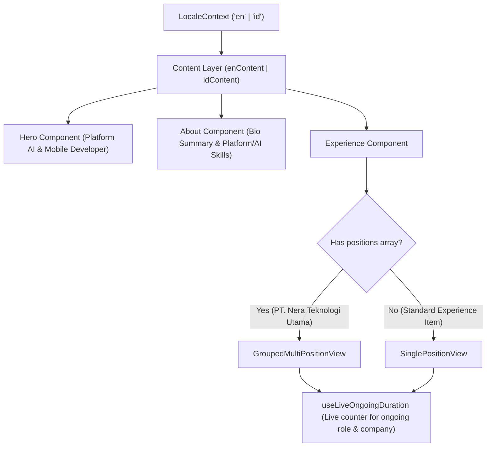

# Modification Design Document: Portfolio Enhancement (Bio, Skills & Grouped Multi-Role Work Experience)

**Target Workspace**: `portfolio-anantyan`  
**Feature Branch**: `feature/enhance-experience-and-bio`  
**Status**: Pending User Review & Approval  

---

## 1. Overview & Goal

The objective of this modification is to reflect Arya Rezza Anantya's career advancement to **Platform AI Engineer & Mobile Developer** at **PT. Nera Teknologi Utama** across the web portfolio. 

Based on the provided LinkedIn career history snapshot (`2026-09-24_22-47-37.png`), the update encompasses:
1. **Bio & Hero Profile Enhancement**:
   - Update primary title to `"Platform AI Engineer & Mobile Developer"`.
   - Update tagline and bio summary in both English (`en`) and Indonesian (`id`) to emphasize the synthesis of multiplatform client systems (Flutter, Kotlin, Swift) with scalable backend architectures, RESTful API orchestration, and resilient AI platform integration.
2. **Enhanced Technical Skills**:
   - Add new platform, architectural, and AI capabilities (`Platform AI`, `System Architecture`, `RESTful API Orchestration`, `Stateful Data Flow`, `Cross-Platform`) while preserving core mobile expertise.
3. **LinkedIn-Style Grouped Multi-Role Experience Component**:
   - Transform the Work Experience section to elegantly support multi-position progression within the same company.
   - For **PT. Nera Teknologi Utama**, display an overarching company tenure with a vertical connecting timeline rail containing:
     - **Platform AI Engineer** (September 2026 — Present / Sekarang · Live duration).
     - **Mobile Developer** (November 2024 — September 2026 · 1 yr 11 mos / 1 thn 11 bln).
   - Retain full compatibility for single-position career items (Omnifit, SYNRGY Academy, Bank Mandiri, Citiasia, Binar Academy).

---

## 2. Design Read & Mode (from Impeccable)

* **Primary Mode**: `Persuade` & `Read`.
* **Audience**: Engineering leaders, tech recruiters, CTOs, and platform architects evaluating technical leadership, cross-stack adaptability, and execution rigor.
* **Tone**: Crisp, authoritative, highly polished engineering craftsmanship without hyperbole or buzzword fatigue.

---

## 3. Anti-Slop Aesthetic Principles (from tasteskill)

* **Typographic Hierarchy**:
  - Hero role rendered in high-contrast `text-accent` (`text-xl font-medium sm:text-2xl`), balanced with `text-balance`.
  - Experience company headers set at `text-base sm:text-lg font-semibold text-foreground`.
  - Position roles set at `text-base font-semibold text-foreground group-hover:text-accent transition-colors`.
  - Prose descriptions strictly constrained to `max-w-[65ch]` with comfortable line height (`leading-relaxed`) to prevent sprawling, unreadable text blocks.
* **Calibrated Palette & Theme Harmony**:
  - Leverages existing CSS custom properties (`--background`, `--surface`, `--border`, `--foreground`, `--muted`, `--accent`).
  - Active/Current role highlighted with an accent-ringed dot (`border-accent bg-background` with a subtle pulsing ping indicator in dark/light mode).
  - Past role anchored with a muted timeline node (`border-border bg-surface`).
* **Structural Precision**:
  - Zero redundant nested cards.
  - Continuous vertical timeline rail (`border-l border-border/80`) with calibrated offsets matching node centers (`-left-[5px]`).
  - Micro-tags/skills pills beneath roles formatted as understated, low-contrast chips (`rounded-md bg-surface border border-border/60 text-xs px-2 py-0.5 text-muted`).
* **Explicit Anti-Patterns Banned**:
  - No generic timeline cards with heavy drop shadows.
  - No garish multi-colored gradient badges.
  - No static hardcoded durations for ongoing roles.

---

## 4. Component & State Architecture

### Data Models (`src/lib/content/types.ts`)

```typescript
export type ExperiencePosition = {
  role: string;
  period: string;
  duration: string;
  durationKey?: string;
  location: string;
  description: string;
  certificateUrl?: string;
  skills?: string[];
  isCurrent?: boolean;
};

export type ExperienceItem = {
  company: string;
  period?: string;
  duration?: string;
  durationKey?: string;
  location?: string;
  employmentType?: string; // e.g. "Full-time" / "Penuh waktu"
  workplaceType?: string;  // e.g. "Remote"
  role?: string;
  description?: string;
  certificateUrl?: string;
  skills?: string[];
  positions?: ExperiencePosition[];
};
```

### Live Duration System (`src/lib/content/ongoing-start-dates.json`)

Configure both the overall company start date and the new role start date:
```json
{
  "nera-teknologi-utama": { "startYear": 2024, "startMonth": 11 },
  "nera-platform-ai": { "startYear": 2026, "startMonth": 9 }
}
```

### Component Flow Diagram



---

## 5. Alternatives Considered

1. **Splitting Nera into two separate detached experience entries**:
   - *Rejected*: Loses the context of continuous progression within the same engineering organization, cluttering the timeline and failing to match the user's explicit preference.
2. **Hardcoding ongoing durations (e.g. '1 mo')**:
   - *Rejected*: Violates the project's existing dynamic duration architecture (`useLiveOngoingDuration` + build-time fallback). By adding `nera-platform-ai` to `ongoing-start-dates.json`, the duration auto-increments cleanly over time.

---

## 6. Playwright E2E Verification Plan

* **Routes to Verify**:
  - `http://localhost:3000/#top` (Hero)
  - `http://localhost:3000/#tentang` (About / Skills)
  - `http://localhost:3000/#pengalaman` (Experience)
* **Viewports**:
  - Desktop: `1440 x 900`
  - Mobile: `375 x 812`
* **Assertions & Checks**:
  1. Hero displays `"Platform AI Engineer & Mobile Developer"`.
  2. Experience section renders PT. Nera Teknologi Utama with both roles: `"Platform AI Engineer"` and `"Mobile Developer"` under a unified vertical timeline.
  3. Locale switcher toggles cleanly between `id` and `en` with proper Indonesian translations.
  4. Theme switcher behaves cleanly in dark and light modes.
  5. Zero console errors or layout shift warnings.
